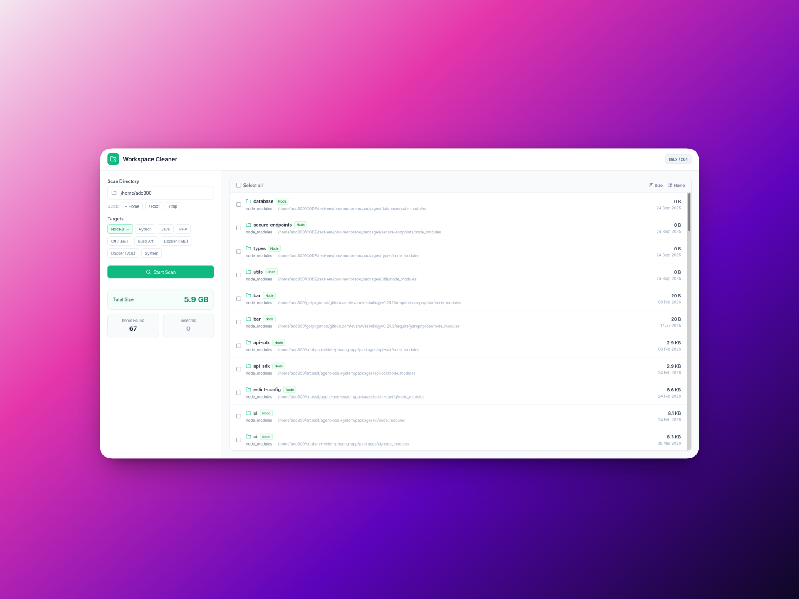

# Workspace Cleaner

A web-based utility to scan your system for large unused folders like `node_modules`, `venv`, `target`, and Docker images/volumes, and easily delete them to free up disk space.



## Features
- **Dashboard UI**: Clean and easy to use dashboard UI.
- **Side-by-side Layout**: Left side for configuring root paths and target types, right side for evaluating and selecting items to delete.
- **Multiple Targets**: Detects Node, Python, Java, PHP, .NET cache folders and build outputs, as well as Docker Images and Volumes.
- **Safety checks**: Restricts deletion and ensures paths are validated before any `rm -rf` operations are executed.

## Technologies Used
- **Backend:** Node.js, Express, TypeScript, Zod
- **Frontend:** HTML, Tailwind CSS, Alpine.js, Lucide Icons

## Prerequisites
- [Node.js](https://nodejs.org/) (v16+)
- Docker (optional, but needed to scan and clean docker volumes/images)

## Getting Started

1. **Install dependencies:**
   ```bash
   npm install
   ```

2. **Start the application:**
   ```bash
   npm start
   ```
   Or for development (with auto-reload):
   ```bash
   npm run dev
   ```

3. **Access the application:**
   Open your browser and navigate to `http://localhost:3456`.

## Using the Tool

1. Enter the absolute path to start scanning from in the **Scan Directory** input box (or select quick options like Home, Root, or Workspace).
2. Check the relevant targets you wish to scan (Node.js, Python, Java, Docker, System Caches, etc).
3. Click "Start Scan". The tool will recursively look through the directories.
4. On the right panel, confirm which items to delete or bulk-select them. 
5. Click **Delete Selected**.

> **Warning:** Use this carefully! Deleting caches or dependencies will not break your apps, but may require reinstalling dependencies (e.g. `npm install` or `pip install`) when you revisit those projects.
